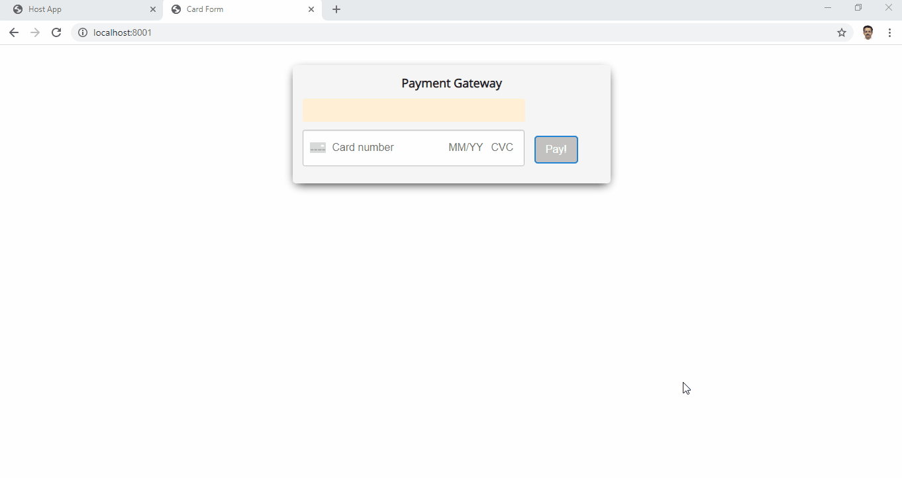

# Zoid Microfrontends

- Demo of zoid based cross domain microfrontends

# Setup

```
yarn
```

# Running

```
yarn serve
```

- This will start the remove widget (Payment Card) on port 8001 and the main host page on port 8002
- Go to http://localhost:8002 and see the injected iframe based payment card injected on the right side of the page



# Template Credits

- Landing Page Copyright 2018-2019 Astrava.Solutions Ltd. Code released under the [MIT license](https://github.com/tailwindtoolbox/Landing-Page/blob/master/LICENSE).
